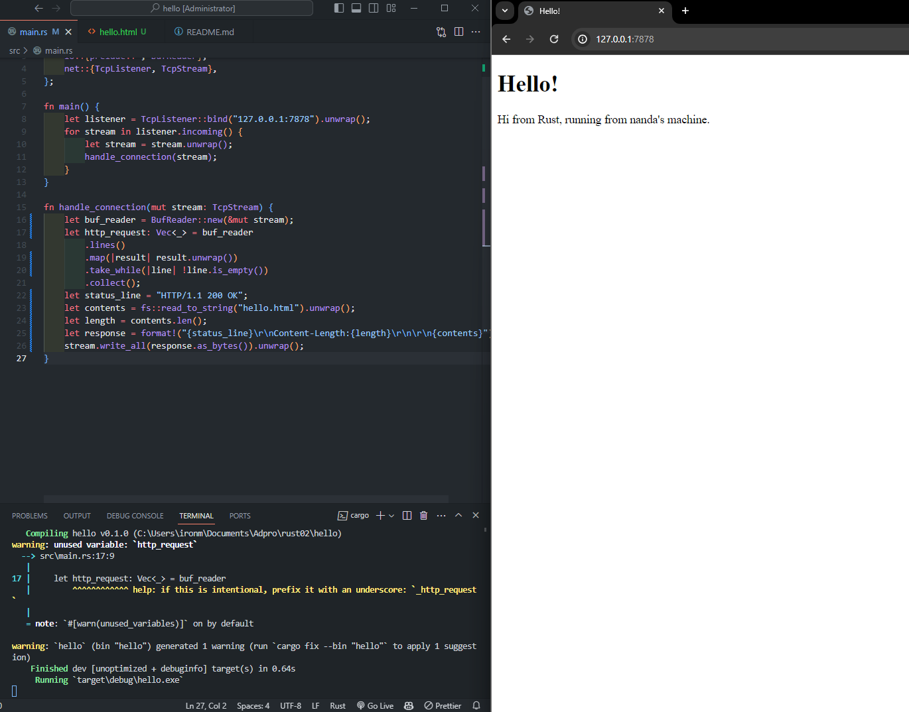
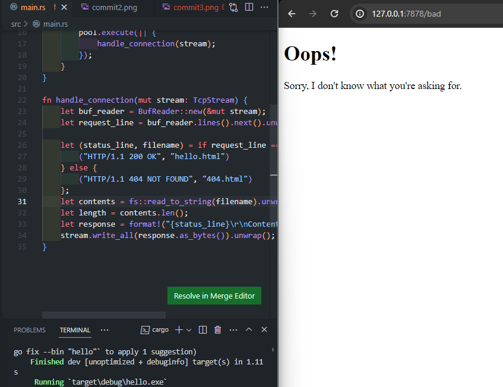

# Reflection Module 6

### Commit 1

Fungsi `handle_connection` bekerja mengatur aliran data dari TCP. Caranya, fungsi `handle_connection` mengambil data dari `TcpStream`, dan memakai `BufReader` untuk membaca datanya supaya lebih gampang dan cepat. `handle_connection` membaca terus menerus sampai menemukan baris yang kosong, soalnya di format HTTP, baris kosong tandanya sudah selesai bagian awalnya. Dan semua yang dibaca tadi tersimpan ke dalam satu tempat, jadi kayak kumpulan permintaan HTTP. Terus, di akhir, `handle_connection` menunjukkan apa yang sudah dikumpulin tadi. Jadi, intinya, dia mengurus data dari TCP, baca per baris, terus mengumpulkan sampai ketemu baris kosong, dan akan menunjukkan hasilnya.

---

### Commit 2

---

### Commit 3

Saya memodifikasi kode dengan menambahkan penggunaan pernyataan if ketika menetapkan nilai untuk baris status respons dan nama file HTML, tujuannya adalah untuk mengurangi jumlah kode yang diulang-ulang.

---

### Commit 4

Dalam perubahan pada fungsi `handle_connection`, saya menambahkan cara baru buat mengurus permintaan dari pengguna, khususnya buat yang `GET /sleep HTTP/1.1`. Awalnya saya masih baca permintaan dari pengguna seperti biasa, untuk sekarang saya pakai cara namanya pencocokan pola untuk maksud apa yang diminta. Kalo ada yang minta halaman utama pake `GET / HTTP/1.1`, saya kasih mereka halaman `hello.html` dengan status `OK`, dan kalo ada yang minta `GET /sleep HTTP/1.1`, artinya mereka minta saya buat `sleep` dulu selama 10 detik sebelum memberikan balasan. Lalu baru kasih mereka halaman `hello.html` sama status `OK`. Jika permintaannya tidak cocok sama yang saya kenal, saya berikan halaman `404.html`, artinya halaman yang diminta tidak ada. Setelah saya tau mau kasih apa, saya baca isi halaman yang ingin ditampilkan, hitung panjangnya, dan susun balasan HTTPnya. Terakhir, saya mengirim balasan itu ke pengguna lewat koneksi yang sama. Jadi, yang baru dari fungsi ini adalah, saya bisa bikin server kita `sleep` lebih sebentar jika ada yang minta khusus, selain itu tetap jalan seperti biasa.

---

### Commit 5

`ThreadPool` itu seperti tim `workers` yang terdiri dari beberapa anggota atau thread. Awalnya, kita tentukan berapa banyak anggota timnya. Lalu, kita kasih cara buat mereka kesempatan sama yang memberikan `workers`, pake sesuatu yang disebut `channel`. Setiap kali ada kerjaan, kerjaan itu dikirim lewat `channel` ke salah satu anggota tim untuk dikerjakan. Sistemnya diatur supaya setiap kerjaan cuma bisa dikerjain sama satu anggota tim, jadi ga ada yang rebutan kerjaan. Dengan begini, banyak kerjaan bisa dikerjain bareng-bareng, bikin proses kerja jadi lebih cepat dan efisien.